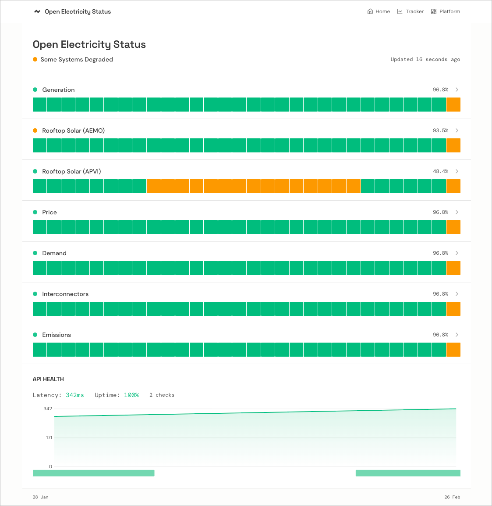

# Open Electricity Status

Status page for the [Open Electricity](https://openelectricity.org.au) data platform. Tracks data freshness, coverage and API health across data and market endpoints.

**[View live status](https://status.openelectricity.org.au)** | [Explorer](https://explore.openelectricity.org.au) | [Platform](https://platform.openelectricity.org.au)



Built with the `openelectricity` typescript client available on npm via the [Open Electricity Platform](https://platform.openelectricity.org.au)

## What it does

- Monitors 7 data series (generation, price, demand, rooftop solar, interconnectors, emissions) across regions
- Checks data freshness every 5 minutes 
- Shows per-region lag, coverage percentage and health status (operational / degraded / down)
- Displays 30-day uptime history with interval-level bitmaps per region per day
- Pings the Open Electricity API `/health` endpoint and tracks latency + uptime over 24 hours
- Renders an interactive SVG latency sparkline with hover tooltips
- Colour-coded status indicators — green for operational, amber for degraded, red for down

## Stack

Vite + React 19 + TailwindCSS v4 + TanStack Query, deployed on Vercel with Blob storage and KV.

## Development

```bash
cp .env.example .env
# add your OPENELECTRICITY_API_KEY

bun install
bun run update-status   # fetch data locally
bun run dev             # http://localhost:5173
```
